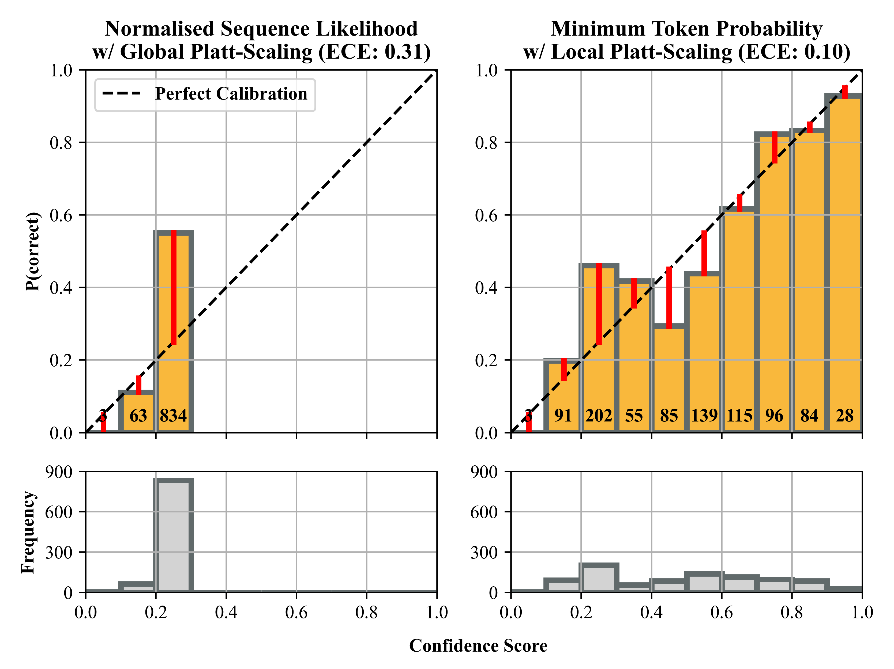

# Fine-grained Approaches for Confidence Calibration of LLMs in Automated Code Revision
Replication package for [Fine-grained Approaches for Confidence Calibration of LLMs in Automated Code Revision](https://arxiv.org/abs/2604.06723)

<div align="center">
  
</div>

<div align="center">Miscalibrated (Left) and Well-Calibrated (Right) Confidence Scores for <br/>Code Revisions Generated by CodeLlama-70B in Automated Code Refinement</a></div>
<br/>

## Setup
- This project requires python3 to run. 
- To setup all dependencies, use the following command: `pip3 install -r requirements.txt`
- The vulnerability repair task requires [Snyk CLI](https://docs.snyk.io/developer-tools/snyk-cli/install-the-snyk-cli) for correctness evaluation using SAST.

## File Structure
```
.
├── codereviewqa_train          # Folder for storing inference results on CR-Trans Training set
├── codereviewqa_trans          # Folder for storing inference results on CR-Trans Test set
├── deepcode_bug                # Folder for storing inference results on DCF-Bug Test set
├── deepcode_train              # Folder for storing inference results on DCF-Bug/DCF-Vul Training set
├── deepcode_vul                # Folder for storing inference results on DCF-Vul Test set
├── LICENSE
├── README.md
├── requirements.txt            # List of dependencies required for the project
├── run_attention.py            # Script for extracting and calculating attention mass
├── run_calibration_eval.py     # Script for calculating confidence and Platt-scaling
├── run_correctness_eval.py     # Script for evaluating correctness of generated code revisions
├── run_embedding.py            # Script for retrieving input/output embeddings
├── run_inference.py            # Script for model inference 
├── static_check                # Folder for storing SAST reports
└── utils                       # Helper functions and fine-grained calibration implementations
    ├── calibrate_utils.py
    ├── data_processor.py
    └── eval_utils.py
```

## Usage
The scripts should be executed in this exact order.
```
# Step 1 Run Inference
python3 run_inference.py <hugging_face_model> <dataset>

# Step 2 Evaluate Correctness
python3 run_correctness_eval.py <result_file> <snyk_org_id> 

# Step 3 Extract and Calculate Attention Mass
python3 run_attention.py <result_file>

# Step 4 Retrieve input/output embeddings
python3 run_embedding.py <result_file>

# Step 5 Calculate confidence and conduct Platt-scaling
python3 run_calibration_eval.py <result_file> <correctness_metric> <confidence_score> <platt_scale_strategy>
```
**Arguments** <br>
- **hugging_face_model** - *the model name on hugging face (e.g., meta-llama/Meta-Llama-3-8B-Instruct)* <br>
- **dataset** - *the target dataset for inference (e.g., codereviewqa_trans)* 
- **result_file** - *the target result file once created (e.g., Llama-3.1-8B-Instruct_codereviewqa_trans)*
- **snyk_org_id** - *the registered organisation ID to use with the snyk CLI*
- **correctness_metric** - *the target correctness metric to calibrate against (e.g., EM)*
- **confidence_score** - *the target confidence score to calibrate (e.g., minimum_token_probability)*
- **platt_scale_strategy** - *the Platt-scaling approach to calibrate with (i.e., global vs local)*

## Reference
```
@article{lin2026fine,
  title={Fine-grained Approaches for Confidence Calibration of LLMs in Automated Code Revision},
  author={Lin, Hong Yi and Liu, Chunhua and Gao, Haoyu and Thongtanunam, Patanamon and Treude, Christoph},
  journal={arXiv preprint arXiv:2604.06723},
  year={2026}
}
```
